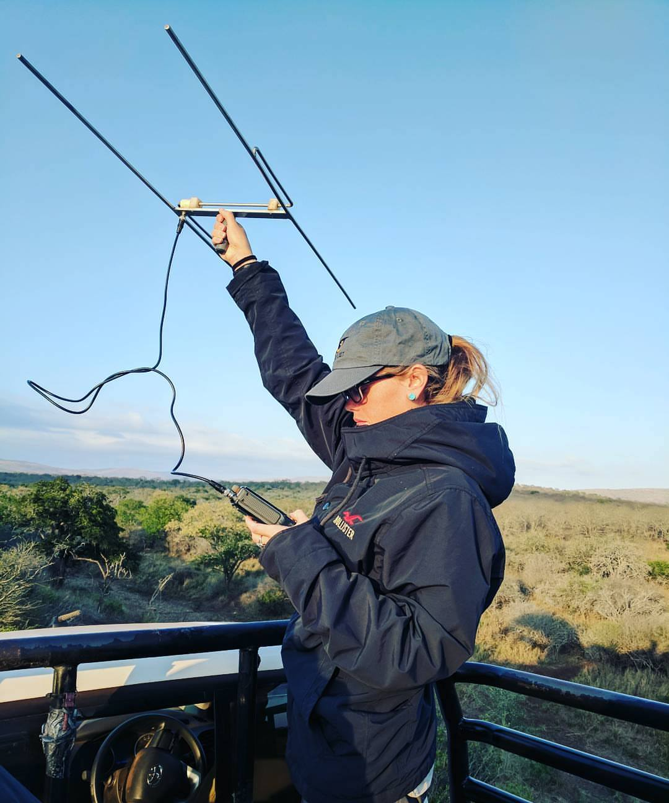
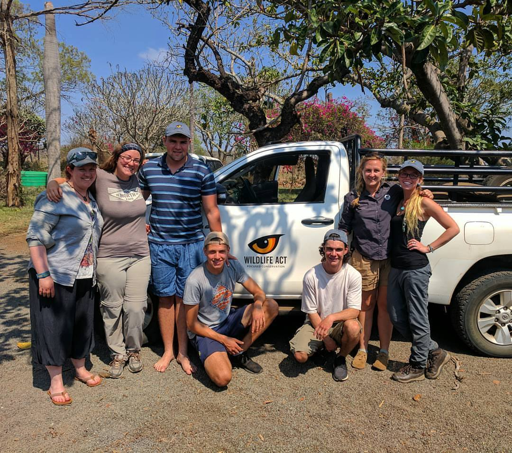
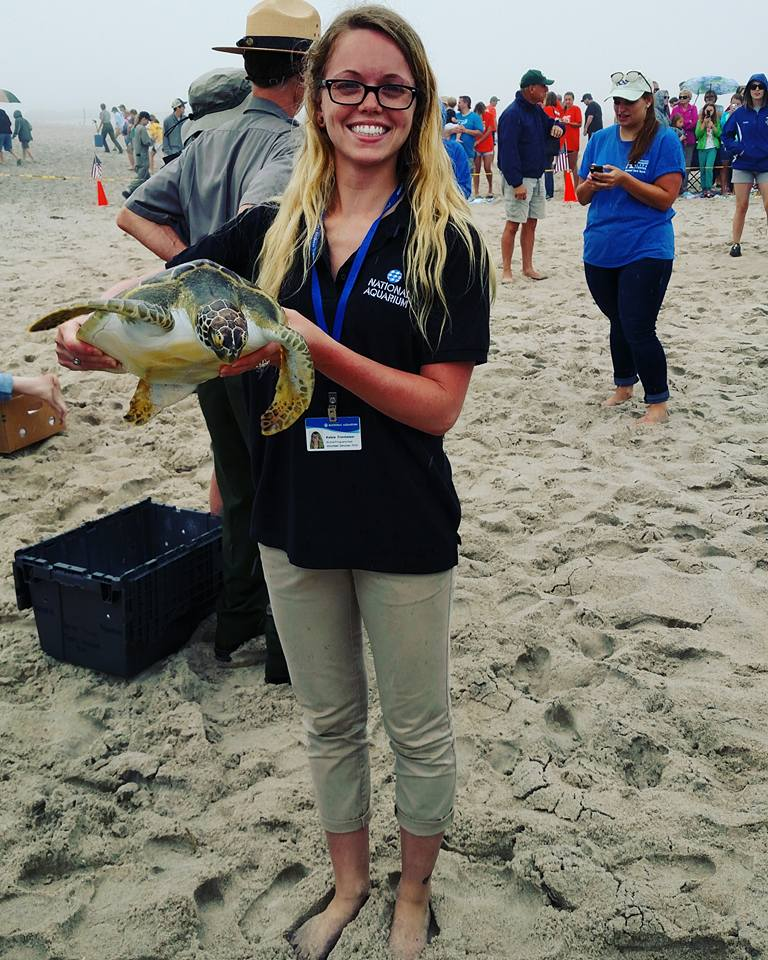
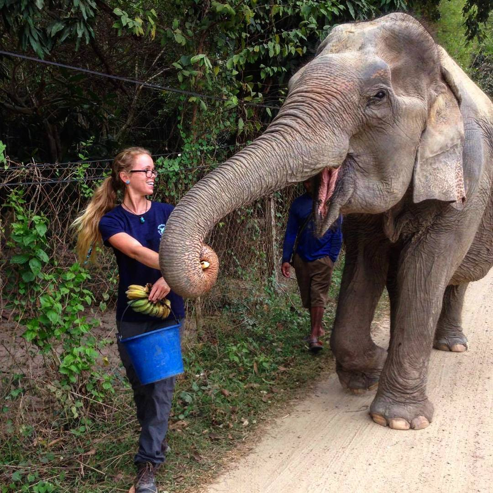

```{r echo = FALSE, message=FALSE}
library(patchwork)



```
While traveling abroad I spent two weeks volunteering with Wildlife Act at Manyoni Private Game Reserve in South Africa where I helped to track endangered radio-collared African wild dogs.


```{r echo = FALSE, message=FALSE}

```

I spent half a year as an animal rescue intern at the National Aquarium in Baltimore, Maryland where I helped to rehabilitate and release Green & Kemp's ridley sea turtles as well as a Harbor seal named Megatron!

```{r echo = FALSE, message=FALSE}

```
While traveling abroad I spent one week volunteering at Wildlife Friends Foundation Thailand in Thailand where I helped with the daily care of rescued Asian elephants, like Boon Mee shown above, who was rescued from a tourist company. 


