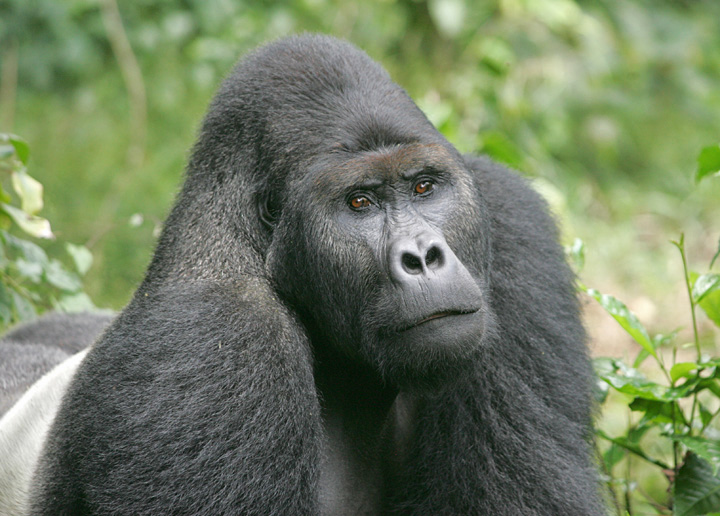
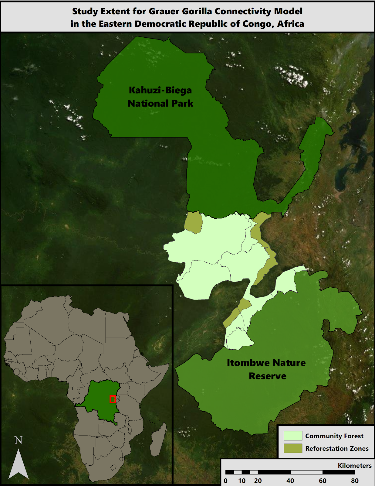

```{r setup, include=FALSE}
knitr::opts_chunk$set(echo = FALSE)
```

***Combining Conservation & Community Empowerment: Protecting Grauer’s Gorillas with Community Forestry***

Strong Roots Congo is working to protect biodiversity and empower local communities in the Sud Kivu province along the eastern border of the Democratic Republic of Congo (DRC) through community forestry and sustainable development projects. Grauer's gorillas are among the many species that call the Congo Basin rain forest their home. Due to multiple threats from poaching, habitat loss and fragmentation, deforestation, resource extraction activities, and civil unrest Grauer's gorillas were classified as critically endangered on the 2016 IUCN Red List.

<br>

***Grauer's gorillas:***
```{r,fig.cap= "A silverback Grauer’s gorilla named Chimanuka that lives in Kahuzi-Biega National Park (Credit: *Strong Roots Congo*)"}
library(patchwork)



```
Grauer’s gorillas play an integral role in tropical rainforest ecology by dispersing seeds and creating cleared areas of the forest where seedlings can germinate with their foraging and nesting habits (Basabose 2016). Grauer’s gorilla’s home ranges have been found to extend 42.3 km2 over 92 months, while shifting and expanding their range monthly and annually, respectively (Yamagiwa 2011). Grauer’s gorillas' prime habitat is primary forest but their home ranges have been found to extend through primary and secondary forests, bamboo forests, and swampland (Yamagiwa 2011). Their ranging patterns are similar to that of Eastern mountain gorillas, in that they reflect a strategy of seeking high-quality herbaceous vegetation while avoiding previously used areas that contain trampled vegetation (Vedder 1984; Watts 1987, 1998). 

Grauer’s gorillas are gregarious and live in family groups, consisting of one silverback male, several adult females, and juveniles. Female Grauer’s gorillas become sexually mature at 9 years of age. Adult females typically give birth to a single infant every four years, with a 8.5 to 9.5 month gestation period. Infant mortality rates are high before the age of 3 due to disease, infanticide, and other natural ailments (Dian Fossey 2014). Gorillas who make it past 3 years of age have a typical life expectancy of 35 to 50 years in the wild. Because of their long life span, late maturity, long gestation period, and high infant mortality rate, Grauer’s gorillas are particularly vulnerable to threats. Prior to civil war in the DRC in 1996 the Grauer’s gorilla population was estimated to be ~16,900 individuals, now however, only an estimated 3,800 individuals remain in the wild (Plumptre et al. 2016). 

<br>

***Threats & Current Population:***

Historically, Grauer’s gorilla range encompassed an area of about 52,000 km2, however intact and available habitat declined by 52% between the 1990s and 2000s (Junker et al. 2013). Human population growth and the increasing demand for arable land and resources is the main cause of gorilla habitat loss in the eastern DRC. The South Kivu region, where Kahuzi-Biega National Park and Itombwe Nature Reserve are located, has a high human density (over 300 people/km2) and an annual population growth rate of 4% (Yamagiwa 2011). Local communities depend on the resources from the land for daily life and use native plants for construction, food, fuel, and medicine; consequently much of the forest has been deforested and degraded by farming, mining, and logging. The agricultural practice of shifting cultivation and exploitative resource extraction have resulted in an increasingly fragmented landscape. Clearings are carved out of the forest to create new, nutrient-rich agricultural fields (Potapov et al. 2012), which then allow for secondary resource extraction, such as timber and mining operations (Geist and Lambin 2002, DeWasseige et al. 2012). When habitat becomes fragmented, Grauer’s gorillas are more likely to encounter humans and are at higher risk from poaching for bushmeat. Due to their large size and terrestrial movement gorillas are considered easy targets for prime bushmeat (Plumptre et al. 2016). Poaching also occurs for the wildlife trade; a whole family group can be killed in the attempts to capture an infant gorilla for the black market.

Due to these multiple threats Grauer’s gorillas have suffered a 77% decline in population over the past twenty years, which is a single Grauer’s gorilla generation (Plumptre et al. 2016). This massive decline resulted in the classification of Grauer’s gorillas as Critically Endangered on the 2016 IUCN Red List. Critically endangered is the highest threat level, meaning they are at extremely high risk of extinction in the wild. The current Grauer’s gorilla population occupies only ~13% of their original range (Mehlman 2008) and are isolated into four subpopulations within protected areas; Maiko National Park, Kahuzi-Biega National Park, Itombwe Nature Reserve, and Tanya Gorilla Reserve (Yamagiwa, 2011).

<br>

***Study Region:***

```{r echo = FALSE, message=FALSE}
library(patchwork)



```

Our study focuses on a community forest network that Strong Roots is developing with the local chiefdoms in the 3,000 square kilometers of unprotected land between Kahuzi-Biega National Park and Itombwe Nature Reserve The interconnected community forests outlined on the map above will form the wildlife corridor between the parks. The reforestation zones are areas designated by Strong Roots to undergo ecological restoration by way of tree plantings in the near future. We ran the analyses on this corridor and the surrounding landscape as there is potential for the community forest to be expanded in the future. 

<br>

***Project Goal & Objectives:***

Our goal is to help Strong Roots and the local communities develop a conservation plan that will ensure the long term persistence of Grauer's gorillas by providing management recommendations for the community forests that will connect gorilla populations in Kahuzi-Biega National Park and Itombwe Nature Reserve and promote sustainable economic development.

We came up with 3 main objectives will help us to accomplish this goal:

1. Model current functional connectivity for Grauer's gorillas between Kahuzi Biega National Park and Itombwe Nature Reserve and investigate how climate change may affect gorilla habitat

2. Analyze local communities’ opinions about existing forest protections to understand the degree of local support for conservation goals and primary community concerns 

3. Develop recommendations and tools for spatial and community development planning for the network of community forests

<br>

**Methods & Results:**

The presentation of our methods and results are pending approval from the client.

<br>

***Recommendations:***

From our results we will provide spatial and community development management recommendations that will identify:

1. Priority conservation areas for gorilla movement

2. Barriers to gorilla movement to prioritize for restoration

3. Areas of resilience towards climate change

4. Areas of least ecological impact for resource extraction and sustainable
community development

5. The primary forestry concerns of local communities and groups 


<br>


**Works Cited:**

Basabose, Augustin K, et al. (June, 2016) Gorilla Journal. Journal of Berggorilla & Regenwald Direkthilfe, No. 52. 

De Wasseige, C., Sidle, J. G., Dupain, J., Beck, J., Nackoney, J., Biang, J. D. M., Leprohon, R., & Malele, S. (n.d.). Forest Zoning Experience in Central Africa. 25.

Geist, H. J., & Lambin, E. F. (2002). Proximate Causes and Underlying Driving Forces of Tropical DeforestationTropical forests are disappearing as the result of many pressures, both local and regional, acting in various combinations in different geographical locations. BioScience, 52(2), 143–150. https://doi.org/10.1641/0006-3568(2002)052[0143:PCAUDF]2.0.CO;2

Junker, J., Blake, S., Boesch, C., Campbell, G., Toit, L. du, Duvall, C., Ekobo, A., Etoga, G., Galat-Luong, A., Gamys, J., Ganas-Swaray, J., Gatti, S., Ghiurghi, A., Granier, N., Hart, J., Head, J., Herbinger, I., Hicks, T. C., Huijbregts, B., … Kuehl, H. S. (2019). Recent decline in suitable environmental conditions for African great apes. Diversity and Distributions, 1077–1091. https://doi.org/10.1111/ddi.12005@10.1111/(ISSN)1472-4642.species-distribution-models-in-conservation-biogeography

Mehlman, P.T. (2008). Current status of wild gorilla populations and strategies for their conservation. In: Mehlman, P.T., Steklis, H.D. & Stoinski, T.S. (eds.), Conservation in the 21st Century: Gorillas as a Case Study. New York: Springer.

Plumptre, A. J., Nixon, S., Kujirakwinja, D. K., Vieilledent, G., Critchlow, R., Williamson, E. A., Nishuli, R., Kirkby, A. E., & Hall, J. S. (2016). Catastrophic Decline of World’s Largest Primate: 80% Loss of Grauer’s Gorilla (Gorilla beringei graueri) Population Justifies Critically Endangered Status. PLOS ONE, 11(10), e0162697. https://doi.org/10.1371/journal.pone.0162697

Potapov, P. V., Turubanova, S. A., Hansen, M. C., Adusei, B., Broich, M., Altstatt, A., Mane, L., & Justice, C. O. (2012). Quantifying forest cover loss in Democratic Republic of the Congo, 2000–2010, with Landsat ETM+ data. Remote Sensing of Environment, 122, 106–116. https://doi.org/10.1016/j.rse.2011.08.027

Unexpected Deaths of Infant Gorillas, (1 December 2014). The Dian Fossey Gorilla Fund International  https://gorillafund.org/unexpected-deaths-of-gorilla-infants/

Vedder A.L. (1984). Movement patterns of a group of free-ranging mountain gorillas (Gorilla gorilla beringei) and their relation to food availability. Am J Primatol 7:73–88

Watts, D.P. (1987). Effects of mountain gorilla foraging activities on the productivity of their food plant species. Afr J Ecol 25:155–163

Watts, D.P. (1998). Long-term habitat use by mountain gorillas (Gorilla gorilla beringei). 2. Reuse of foraging areas in relation to resource abundance, quality, and depletion. Int J Primatol 19:681–702

Yamagiwas, J., Basabose, A. K., Kahekwa, J., Bikaba, D., Ando, C., Matsubara, M., Iwasaki, N., Sprague, D. (14 November 2011). Long-Term Research on Grauer’s Gorillas in Kahuzi-Biega National Park, DRC: Life History, Foraging Strategies, and Ecological Differentiation from Sympatric Chimpanzees. Springer, Berlin, Heidelberg. https://doi.org/10.1007/978-3-642-22514-7_17


